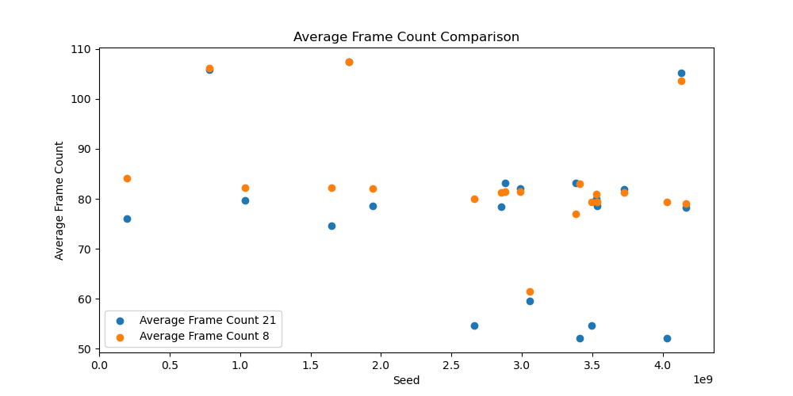
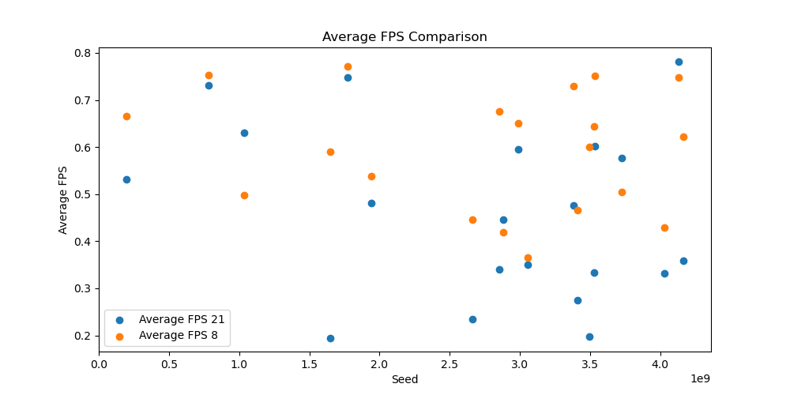
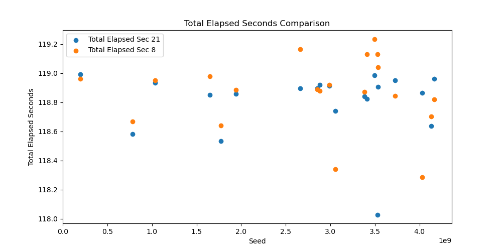

# Setup to compare results: 
_**NOTE: README IS A WORK IN PROGRESS**_

This guide is to help compare JavaConway_002's JavaFX implementation between Java/JavaFX 8 and Java/JavaFX 21 
- Overview
- Setup
- Compile
- Test run
- Run both and get results

## Overview

Bash scripts are used for compiling and running Java applicaiton between java 8 and java 21

```bash
-rwxr-xr-x 1 peter peter 1949 Mar 22 14:07 compile21.sh
-rwxr-xr-x 1 peter peter 1916 Mar 22 14:07 compile8.sh
-rwxr-xr-x 1 peter peter  568 Mar 22 13:45 run21.sh
-rwxr-xr-x 1 peter peter 1822 Mar 22 13:46 run21.with.seed.sh
-rwxr-xr-x 1 peter peter  629 Mar 22 13:45 run8.sh
-rwxr-xr-x 1 peter peter 1819 Mar 22 13:46 run8.with.seed.sh
-rwxr-xr-x 1 peter peter 2688 Mar 22 13:32 runmulti.record.sh
```

## Diagrams
Activity and UML diagrams for the Java Conway application 


## Setup 
This is expected to be run on a Linux type system to take advantage of the time command

because of this the compile and runtimes are handled with shell scripts so to not distrub host system


## How To Compile

### Setup _compile8.sh_
  - If a different jdk is wanted to be used for 8, replace JAVA_HOME, see bleow:
  - NOTE: **if another java8 verison is used ensure _jfxrt.jar_ is included**

  compile8.sh
```bash
# Enable recursive globbing for ** patterns
shopt -s globstar

JAVA_HOME="/opt/javafx-sdk/jdk8u442-full"

# Variables (modify as needed)
# JAVAFX_LIB="/opt/javafx-sdk/jdk8u442-full/jre/lib/ext/jfxrt.jar" 
# Java 8 does not require the JavaFX_LIB and MODULES settings as in later jdks
```
### Compile conway8.jar

run:

```bash
./compile8.sh
```
results:
```bash
Removing existing target directory target...
Preparing to compile Java source files...
Compiling Java source files from src/main/java into target...
Packaging the JAR file as conway8.jar...
Build successful! JAR file created: conway8.jar

```

### Setup compile21.sh
  - After java8 the JDKs for Java JavaFX are separate, in order to compile a jar correctly other variables are needed
  - NOTE: JAVA_HOME and JAVAFX_LIB are different and held in different places on the system.
  - The zips from wherever the JDKs are downloaded from can be unziped anywhere accessable and pointed to here
```bash
# Enable recursive globbing for ** patterns
shopt -s globstar

JAVA_HOME="/usr/lib/jvm/jdk-21.0.6+7/"  # Adjust this path to your JavaFX SDK installation

# Variables (modify as needed)
JAVAFX_LIB="/opt/javafx-sdk/javafx-sdk-21.0.6/lib"
MODULES="javafx.controls"
```
### Compile conway21.jar

run:
```bash
./compile21.sh 
```
results:
```bash
Removing existing target directory target...
Preparing to compile Java source files...
Compiling Java source files from src/main/java into target...
Packaging the JAR file as conway21.jar...
Build successful! JAR file created: conway21.jar
```

# Example Results





