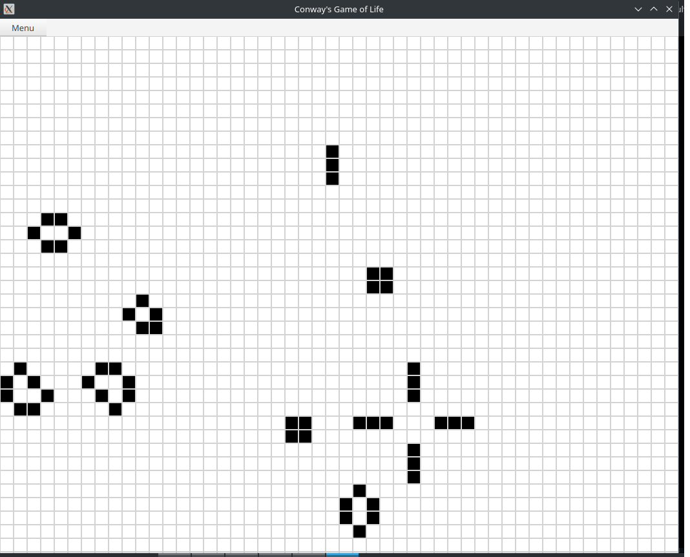
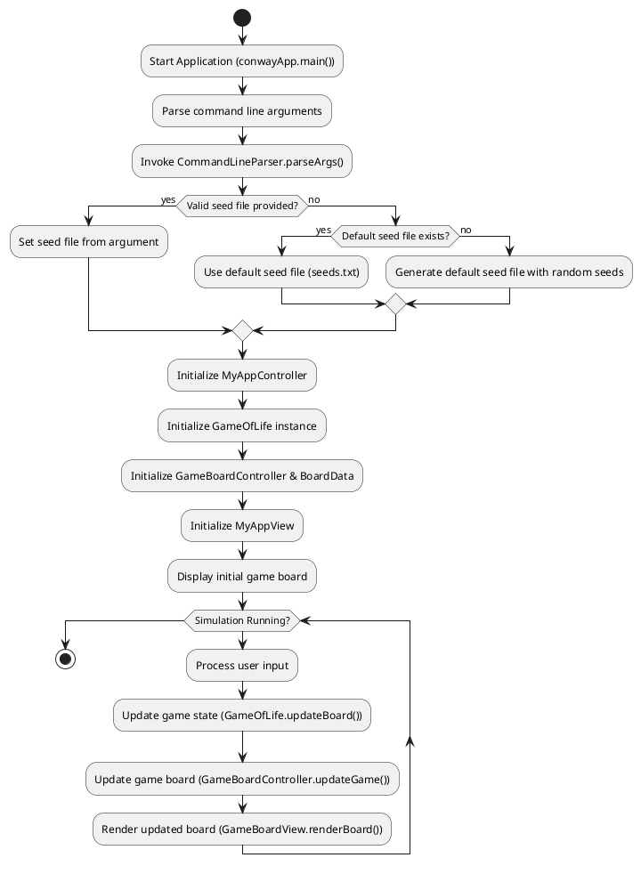
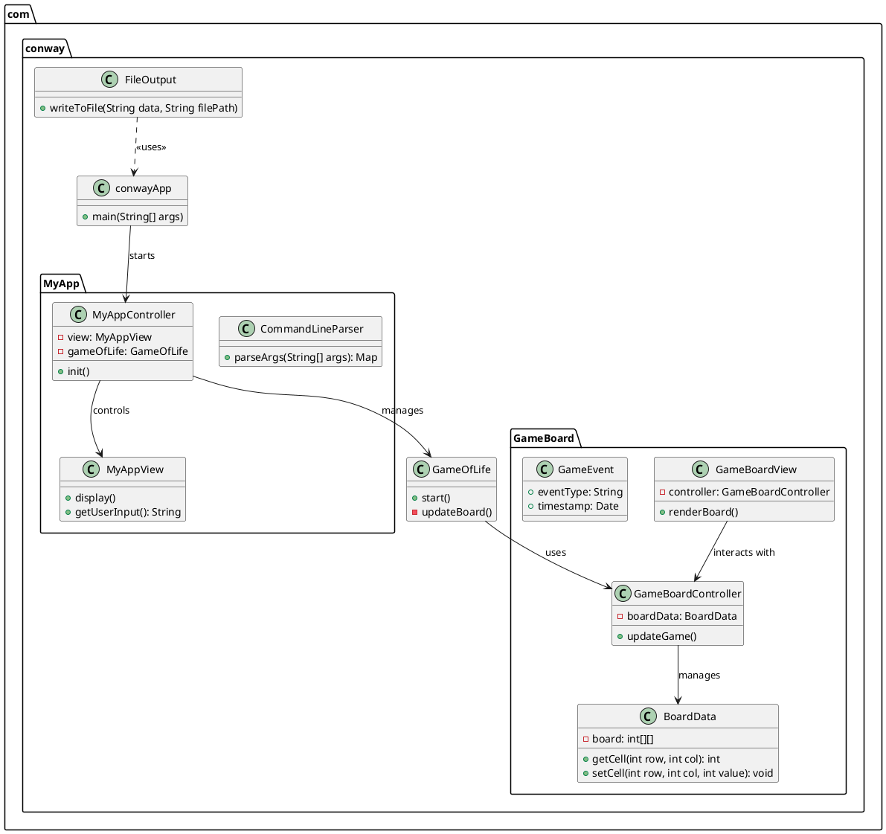
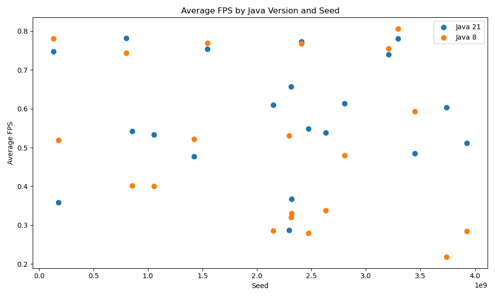
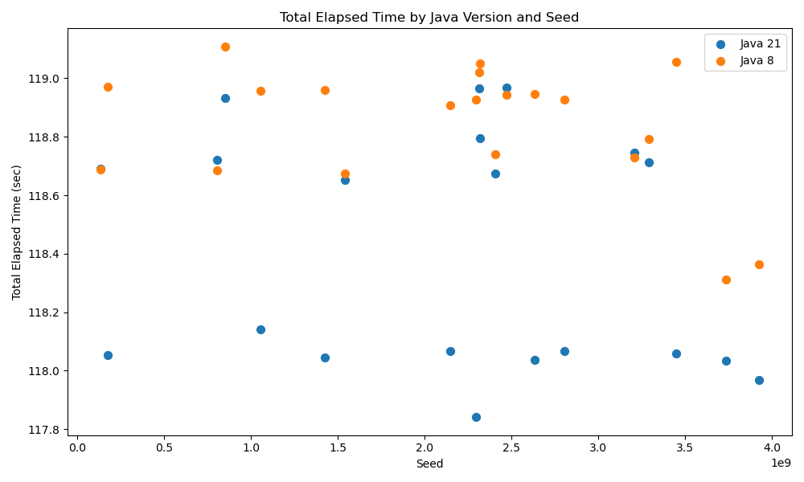

# Setup to compare results: 
_**NOTE: README IS A WORK IN PROGRESS**_

This guide is to help compare JavaConway_002's JavaFX implementation between Java/JavaFX 8 and Java/JavaFX 21 
- Overview
- Setup
- Compile
- Test run
- Run both and get results

## Overview

Bash scripts are used for compiling and running Java applicaiton between java 8 and java 21

```bash
-rwxr-xr-x 1 peter peter 1949 Mar 22 14:07 compile21.sh
-rwxr-xr-x 1 peter peter 1916 Mar 22 14:07 compile8.sh
-rwxr-xr-x 1 peter peter  568 Mar 22 13:45 run21.sh
-rwxr-xr-x 1 peter peter 1822 Mar 22 13:46 run21.with.seed.sh
-rwxr-xr-x 1 peter peter  629 Mar 22 13:45 run8.sh
-rwxr-xr-x 1 peter peter 1819 Mar 22 13:46 run8.with.seed.sh
-rwxr-xr-x 1 peter peter 2688 Mar 22 13:32 runmulti.record.sh
```

## Diagrams
Activity and UML diagrams for the Java Conway application 




## Setup 
This is expected to be run on a Linux type system to take advantage of the time command

because of this the compile and runtimes are handled with shell scripts so to not distrub host system


## How To Compile

### Setup _compile8.sh_
  - If a different jdk is wanted to be used for 8, replace JAVA_HOME, see bleow:
  - NOTE: **if another java8 verison is used ensure _jfxrt.jar_ is included**

  compile8.sh
```bash
# Enable recursive globbing for ** patterns
shopt -s globstar

JAVA_HOME="/opt/javafx-sdk/jdk8u442-full"

# Variables (modify as needed)
# JAVAFX_LIB="/opt/javafx-sdk/jdk8u442-full/jre/lib/ext/jfxrt.jar" 
# Java 8 does not require the JavaFX_LIB and MODULES settings as in later jdks
```
### Compile conway8.jar

run:

```bash
./compile8.sh
```
results:
```bash
Removing existing target directory target...
Preparing to compile Java source files...
Compiling Java source files from src/main/java into target...
Packaging the JAR file as conway8.jar...
Build successful! JAR file created: conway8.jar

```

### Setup compile21.sh
  - After java8 the JDKs for Java JavaFX are separate, in order to compile a jar correctly other variables are needed
  - NOTE: JAVA_HOME and JAVAFX_LIB are different and held in different places on the system.
  - The zips from wherever the JDKs are downloaded from can be unziped anywhere accessable and pointed to here
```bash
# Enable recursive globbing for ** patterns
shopt -s globstar

JAVA_HOME="/usr/lib/jvm/jdk-21.0.6+7/"  # Adjust this path to your JavaFX SDK installation

# Variables (modify as needed)
JAVAFX_LIB="/opt/javafx-sdk/javafx-sdk-21.0.6/lib"
MODULES="javafx.controls"
```
### Compile conway21.jar

run:
```bash
./compile21.sh 
```
results:
```bash
Removing existing target directory target...
Preparing to compile Java source files...
Compiling Java source files from src/main/java into target...
Packaging the JAR file as conway21.jar...
Build successful! JAR file created: conway21.jar
```

# Example Results




| seed       | total_elapsed_sec_21       | total_elapsed_sec_8        | avg_fps_21              | avg_fps_8               | avg_frame_count_21       | avg_frame_count_8        | sum_frame_count_21 | sum_frame_count_8 |
|------------|----------------------------|----------------------------|-------------------------|-------------------------|--------------------------|--------------------------|--------------------|-------------------|
| 1056372412 | 118.14254799999999         | 118.95718600000001         | 0.5337262579673102      | 0.40064614069875515     | 75.49152542372882        | 73.69747899159664        | 8908.0             | 8770.0            |
| 133552649  | 118.690305                 | 118.688211                 | 0.7481699886587634      | 0.7808772417218696      | 103.05882352941177       | 101.7983193277311        | 12264.0            | 12114.0           |
| 1423728281 | 118.04484599999999         | 118.958534                 | 0.4769278239211772      | 0.5212266463025751      | 74.3135593220339         | 68.4201680672269         | 8769.0             | 8142.0            |
| 1542914117 | 118.652364                 | 118.67478000000001         | 0.7540156493450186      | 0.7689589113498706      | 102.7983193277311        | 99.02521008403362        | 12233.0            | 11784.0           |
| 177069767  | 118.054772                 | 118.970627                 | 0.35787612721582157     | 0.5198441570538054      | 74.35593220338983        | 77.5798319327731         | 8774.0             | 9232.0            |
| 2146970708 | 118.067956                 | 118.90828900000001         | 0.6097588399266085      | 0.2861243728212267      | 76.71186440677967        | 77.57142857142857        | 9052.0             | 9231.0            |
| 2296444611 | 117.842776                 | 118.926161                 | 0.28665507100107906     | 0.5304386923921561      | 76.53389830508475        | 71.81512605042016        | 9031.0             | 8546.0            |
| 2314597437 | 118.96475699999999         | 119.019984                 | 0.6572827223946955      | 0.32057245808718815     | 73.83193277310924        | 77.38655462184875        | 8786.0             | 9209.0            |
| 2317690769 | 118.794988                 | 119.05143999999999         | 0.3672452341348971      | 0.3305252598675474      | 63.89915966386555        | 64.4873949579832         | 7604.0             | 7674.0            |
| 2408245329 | 118.67309900000001         | 118.740527                 | 0.7729079555449522      | 0.767554127330708       | 104.63025210084034       | 106.25210084033614       | 12451.0            | 12644.0           |
| 2470122537 | 118.967772                 | 118.942973                 | 0.5484945411943813      | 0.27912859684516506     | 72.83193277310924        | 76.33613445378151        | 8667.0             | 9084.0            |
| 2631919757 | 118.03825599999999         | 118.945053                 | 0.5380813548545176      | 0.33795076705704585     | 74.94915254237289        | 78.90756302521008        | 8844.0             | 9390.0            |
| 2802785516 | 118.06759600000001         | 118.92615599999999         | 0.6135160064221029      | 0.4800319038831826      | 77.82203389830508        | 78.09243697478992        | 9183.0             | 9293.0            |
| 3206142999 | 118.74649900000001         | 118.72905899999999         | 0.7403315640265222      | 0.7557509726032168      | 105.12605042016807       | 105.1344537815126        | 12510.0            | 12511.0           |
| 3292756640 | 118.713203                 | 118.79319899999999         | 0.7807761715411328      | 0.805906497643469       | 103.85714285714286       | 100.36974789915966       | 12359.0            | 11944.0           |
| 3446904805 | 118.05824799999999         | 119.056312                 | 0.4850045617751071      | 0.5932134294478022      | 75.05932203389831        | 76.45378151260505        | 8857.0             | 9098.0            |
| 3737452558 | 118.03504699999999         | 118.31179300000001         | 0.603661192709519       | 0.21841062047995727     | 76.27118644067797        | 50.220338983050844       | 9000.0             | 5926.0            |
| 3925925239 | 117.968586                 | 118.364553                 | 0.5113369419992336      | 0.2842215095937055      | 76.6864406779661         | 50.26271186440678        | 9049.0             | 5931.0            |
| 802661562  | 118.71956999999999         | 118.686544                 | 0.7824322856029229      | 0.7437039977912354      | 101.27731092436974       | 102.08403361344538       | 12052.0            | 12148.0           |
| 853134403  | 118.932614                 | 119.107223                 | 0.5426316812186868      | 0.4020704098459762      | 73.71428571428571        | 73.70588235294117        | 8772.0             | 8771.0            |

