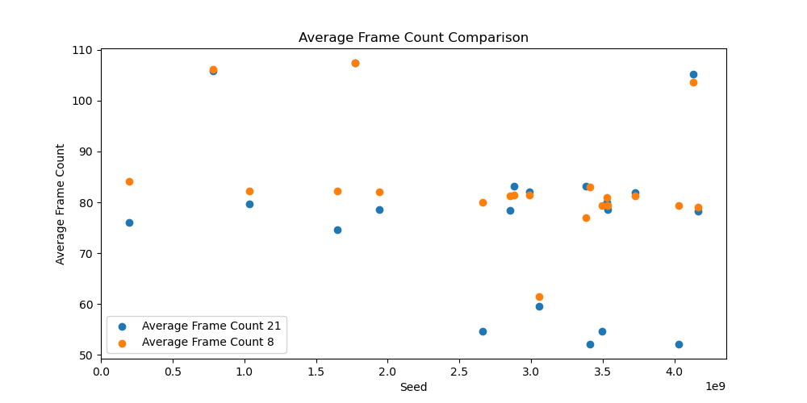

# Setup to compare results: 
_**NOTE: README IS A WORK IN PROGRESS**_

This guide is to help compare JavaConway_002's JavaFX implementation between Java/JavaFX 8 and Java/JavaFX 21 
- Overview
- Setup
- Compile
- Test run
- Run both and get results

## Overview

Bash scripts are used for compiling and running Java applicaiton between java 8 and java 21

```bash
-rwxr-xr-x 1 peter peter 1949 Mar 22 14:07 compile21.sh
-rwxr-xr-x 1 peter peter 1916 Mar 22 14:07 compile8.sh
-rwxr-xr-x 1 peter peter  568 Mar 22 13:45 run21.sh
-rwxr-xr-x 1 peter peter 1822 Mar 22 13:46 run21.with.seed.sh
-rwxr-xr-x 1 peter peter  629 Mar 22 13:45 run8.sh
-rwxr-xr-x 1 peter peter 1819 Mar 22 13:46 run8.with.seed.sh
-rwxr-xr-x 1 peter peter 2688 Mar 22 13:32 runmulti.record.sh
```

## Diagrams
Activity and UML diagrams for the Java Conway application 


## Setup 
This is expected to be run on a Linux type system to take advantage of the time command

because of this the compile and runtimes are handled with shell scripts so to not distrub host system


## How To Compile

### Setup _compile8.sh_
  - If a different jdk is wanted to be used for 8, replace JAVA_HOME, see bleow:
  - NOTE: **if another java8 verison is used ensure _jfxrt.jar_ is included**

  compile8.sh
```bash
# Enable recursive globbing for ** patterns
shopt -s globstar

JAVA_HOME="/opt/javafx-sdk/jdk8u442-full"

# Variables (modify as needed)
# JAVAFX_LIB="/opt/javafx-sdk/jdk8u442-full/jre/lib/ext/jfxrt.jar" 
# Java 8 does not require the JavaFX_LIB and MODULES settings as in later jdks
```
### Compile conway8.jar

run:

```bash
./compile8.sh
```
results:
```bash
Removing existing target directory target...
Preparing to compile Java source files...
Compiling Java source files from src/main/java into target...
Packaging the JAR file as conway8.jar...
Build successful! JAR file created: conway8.jar

```

### Setup compile21.sh
  - After java8 the JDKs for Java JavaFX are separate, in order to compile a jar correctly other variables are needed
  - NOTE: JAVA_HOME and JAVAFX_LIB are different and held in different places on the system.
  - The zips from wherever the JDKs are downloaded from can be unziped anywhere accessable and pointed to here
```bash
# Enable recursive globbing for ** patterns
shopt -s globstar

JAVA_HOME="/usr/lib/jvm/jdk-21.0.6+7/"  # Adjust this path to your JavaFX SDK installation

# Variables (modify as needed)
JAVAFX_LIB="/opt/javafx-sdk/javafx-sdk-21.0.6/lib"
MODULES="javafx.controls"
```
### Compile conway21.jar

run:
```bash
./compile21.sh 
```
results:
```bash
Removing existing target directory target...
Preparing to compile Java source files...
Compiling Java source files from src/main/java into target...
Packaging the JAR file as conway21.jar...
Build successful! JAR file created: conway21.jar
```

# Results




| seed       | total_elapsed_sec (22) | total_elapsed_sec (8) | avg_fps (22) | avg_fps (8) | avg_frame_count (22) | avg_frame_count (8) | sum_frame_count (22) | sum_frame_count (8) |
|------------|------------------------|-----------------------|--------------|-------------|----------------------|---------------------|----------------------|---------------------|
| 1033437363 | 118.932678             | 118.951360            | 0.498393     | 0.630330    | 82.193277            | 79.714286           | 9781.0               | 9486.0              |
| 1646684781 | 118.851616             | 118.979471            | 0.589620     | 0.195055    | 82.302521            | 74.588235           | 9794.0               | 8876.0              |
| 1774789858 | 118.534182             | 118.641569            | 0.771536     | 0.748273    | 107.504202           | 107.428571          | 12793.0              | 12784.0             |
| 1943520067 | 118.858020             | 118.884320            | 0.537842     | 0.481147    | 82.033613            | 78.655462           | 9762.0               | 9360.0              |
| 197181812  | 118.992141             | 118.960762            | 0.666263     | 0.531147    | 84.126050            | 76.084034           | 10011.0              | 9054.0              |
| 2663508704 | 118.895820             | 119.165107            | 0.446168     | 0.234733    | 79.991597            | 54.647059           | 9519.0               | 6503.0              |
| 2852405230 | 118.896350             | 118.888683            | 0.675609     | 0.340451    | 81.302521            | 78.495798           | 9675.0               | 9341.0              |
| 2882986532 | 118.921027             | 118.880072            | 0.418723     | 0.445271    | 81.369748            | 83.218487           | 9683.0               | 9903.0              |
| 2986831233 | 118.914641             | 118.919033            | 0.650896     | 0.595944    | 81.462185            | 82.126050           | 9694.0               | 9773.0              |
| 3053474506 | 118.739858             | 118.341507            | 0.365983     | 0.349658    | 61.420168            | 59.584746           | 7309.0               | 7031.0              |
| 3385079617 | 118.840585             | 118.872881            | 0.728905     | 0.476033    | 77.050420            | 83.151261           | 9169.0               | 9895.0              |
| 3411503267 | 118.823205             | 119.131594            | 0.465591     | 0.275175    | 83.000000            | 52.201681           | 9877.0               | 6212.0              |
| 3497448862 | 118.987017             | 119.235625            | 0.601015     | 0.197227    | 79.394958            | 54.596639           | 9448.0               | 6497.0              |
| 3530267704 | 118.028598             | 119.132096            | 0.643417     | 0.333896    | 80.957627            | 80.033613           | 9553.0               | 9524.0              |
| 3534201447 | 118.905263             | 119.039799            | 0.751178     | 0.601984    | 79.436975            | 78.588235           | 9453.0               | 9352.0              |
| 3724544668 | 118.952107             | 118.842831            | 0.504888     | 0.576901    | 81.352941            | 81.941176           | 9681.0               | 9751.0              |
| 4031530085 | 118.866091             | 118.284587            | 0.429099     | 0.331706    | 79.352941            | 52.050847           | 9443.0               | 6142.0              |
| 4129079762 | 118.637893             | 118.702248            | 0.748266     | 0.782274    | 103.546218           | 105.201681          | 12322.0              | 12519.0             |
| 4163503295 | 118.959790             | 118.819295            | 0.622227     | 0.358834    | 79.042017            | 78.260504           | 9406.0               | 9313.0              |
| 779353579  | 118.580563             | 118.667639            | 0.752284     | 0.731274    | 106.235294           | 105.915966          | 12642.0              | 12604.0             |


